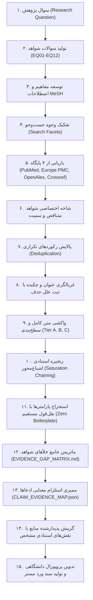

# پروتکل پژوهش عمیق متون علمی و مدیریت شواهد (Deep Literature Research Protocol v3.0)

این پروتکل استاندارد کشف چندپایگاهی، غربالگری دومرحله‌ای، واکشی سلسله‌مراتبی متن کامل، ممیزی استلزام ادعا-شواهد (Claim-Evidence Entailment)، و ماتریس تحلیل خلأها را برای تدوین پروپوزال‌های پژوهشی علوم پزشکی تبیین می‌کند.

---

### ۱. معماری ۱۵ مرحله‌ای قیف شواهد (The 15-Stage Evidence Funnel)

---

### ۲. سطوح سه‌گانه منابع (Source Tiers)

1. **Tier A (متن کامل تأییدشده PMC OA XML / Europe PMC XML > 1000 کاراکتر):**
   - منحصراً برای استخراج مقادیر کمی (IC50، دوزهای حیوانی، فواصل زمانی انکوباسیون) و شواهد مستقیم کسکیدهای مولکولی.
   - *خط قرمز:* چکیده مقاله به هیچ عنوان متن کامل محسوب نمی‌شود.
2. **Tier B (چکیده و متادیتای تأییدشده):**
   - برای تبیین بستر پژوهش، اهمیت موضوع، اپیدمیولوژی، و شواهد زمینه‌ای.
3. **Tier C (سرنخ‌های اولیه بدون متن کامل):**
   - رکوردهایی که در مراحل اولیه کشف شده اما فاقد شرایط ورود به استخراج عمیق هستند (در رجیستری منابع ثبت می‌شوند اما در پروپوزال استناد نمی‌شوند مگر در صورت ارتقا به Tier A/B).

---

### ۳. حوزه‌های ۱۲ گانه سوالات شواهد (The 12 Evidence Question Categories)

- **EQ01: انکولوژی مستقیم و سمیت سلولی (Direct Oncology & Cytotoxicity):** مقادیر IC50، درصد مهار رشد، و سینتیک زنده‌مانی.
- **EQ02: کسکیدهای پیام‌رسانی مولکولی (Molecular Signaling Pathways):** کاسپازها، نسبت Bax/Bcl-2، مهار Akt، و فعال‌سازی NF-kB.
- **EQ03: متدولوژی هم‌افزایی و درمان ترکیبی (Combination & Synergy):** ضابطه تصمیم‌گیری چو-تالالی و آزمون ایزوبولوگرام.
- **EQ04: مدل‌های سلولی و حیوانی (Cellular & Animal Models):** سلول ۴T1 و مدل سینژنیک موش BALB/c.
- **EQ05: شاخص درمانی و ارزیابی ایمنی (Safety & Therapeutic Index):** پنجره دوز ایمن و مهار سمیت بر بافت‌های سالم.
- **EQ06: دارورسانی و فارماکوکینتیک (Pharmacokinetics & Delivery):** حلالیت، کنترل DMSO زیر ۰.۱٪، و پایداری درونزاد.
- **EQ07: موانع مقاومت زیستی و آنتاگونیسم (Resistance & Antagonism):** پدیده‌های مقاومت دارویی/ویروسی و راهکارهای غلبه بر آن.
- **EQ08: سینتیک و انکولیز ویروسی (Viral Replication & Tropism):** تکثیر انتخابی، تیتر ویروس، و گلیکوپروتئین‌های سطحی.
- **EQ09: ریزمحیط تومور و مرگ ایمونوژنیک (Immunological TME & ICD):** آزادسازی کالرتیکولین، HMGB1 و ترشح سایتوکاین‌ها.
- **EQ10: بیومارکرهای پیش‌بینی‌پذیر پاسخ (Biomarkers & Predictors):** وضعیت مسیر اینترفرون و حساسیت سلولی.
- **EQ11: ترجمان بالینی و چشم‌انداز انسانی (Clinical Translation):** بنچ‌مارک‌های کارآزمایی‌های بالینی ویروس‌درمانی و ترپن‌ها.
- **EQ12: استانداردهای متدولوژیک آزمایشگاهی (Methodological Standards):** کنترل‌های سنجش MTT و فلوسایتومتری.

---

### ۴. نگاشت استلزام ادعا-شواهد (Claim-Evidence Entailment)

هر ادعای مطرح‌شده در پروپوزال باید دارای رتبه استلزام صریح باشد:
- `DIRECTLY_SUPPORTED`: نقل‌قول مستقیم درون‌متنی ادعا را با افعال عملکردی اثبات می‌کند.
- `PARTIALLY_SUPPORTED`: شواهد مدل مرتبط یا همبستگی آماری بدون اثبات تام.
- `INDIRECT_SUPPORT`: استنتاج مکانیسمی بر پایه متون مروری یا زمینه تئوریک.
- `CONTRADICTORY`: شواهد حاکی از بروز آنتاگونیسم یا سمیت فراتر از آستانه.
- `NOT_SUPPORTED`: ادعایی که فاقد مستند درون‌متنی است.
- `NOT_REPORTED`: پارامتر در مقاله ذکر نشده است (`NR`).

---

### ۵. سیاست اصالت مقید (Bounded Novelty Statement)
در تمامی گزارش‌ها و متون پروپوزال، نوآوری طرح منحصراً در چارچوب مرز جست‌وجوی مستندشده بیان می‌گردد:
> "No directly matching study evaluating the simultaneous combination of Lupeol and oncolytic Newcastle Disease Virus in the 4T1 murine mammary carcinoma model was identified within the documented search boundary (PubMed, Europe PMC, OpenAlex, Crossref; 2020-2026)."
