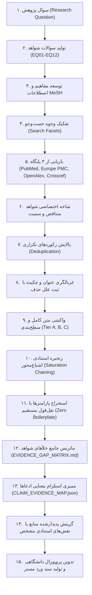

# پروتکل پژوهش عمیق متون علمی و مدیریت شواهد (Deep Literature Research Protocol v3.0)

این پروتکل استاندارد کشف چندپایگاهی، غربالگری دومرحله‌ای، واکشی سلسله‌مراتبی متن کامل، ممیزی استلزام ادعا-شواهد (Claim-Evidence Entailment)، و ماتریس تحلیل خلأها را برای تدوین پروپوزال‌های پژوهشی علوم پزشکی تبیین می‌کند.

---

### ۱. معماری ۱۵ مرحله‌ای قیف شواهد (The 15-Stage Evidence Funnel)

---

### ۲. سطوح سه‌گانه منابع (Source Tiers)

1. **Tier A (متن کامل تأییدشده PMC OA XML / Europe PMC XML > 1000 کاراکتر):**
   - منحصراً برای استخراج مقادیر کمی (IC50، دوزهای حیوانی، فواصل زمانی انکوباسیون) و شواهد مستقیم کسکیدهای مولکولی.
   - *خط قرمز:* چکیده مقاله به هیچ عنوان متن کامل محسوب نمی‌شود.
2. **Tier B (چکیده و متادیتای تأییدشده):**
   - برای تبیین بستر پژوهش، اهمیت موضوع، اپیدمیولوژی، و شواهد زمینه‌ای.
3. **Tier C (سرنخ‌های اولیه بدون متن کامل):**
   - رکوردهایی که در مراحل اولیه کشف شده اما فاقد شرایط ورود به استخراج عمیق هستند (در رجیستری منابع ثبت می‌شوند اما در پروپوزال استناد نمی‌شوند مگر در صورت ارتقا به Tier A/B).

---

### ۳. حوزه‌های ۱۲ گانه سوالات شواهد (The 12 Evidence Question Categories)

- **EQ01: انکولوژی مستقیم و سمیت سلولی (Direct Oncology & Cytotoxicity):** مقادیر IC50، درصد مهار رشد، و سینتیک زنده‌مانی.
- **EQ02: کسکیدهای پیام‌رسانی مولکولی (Molecular Signaling Pathways):** کاسپازها، نسبت Bax/Bcl-2، مهار Akt، و فعال‌سازی NF-kB.
- **EQ03: متدولوژی هم‌افزایی و درمان ترکیبی (Combination & Synergy):** ضابطه تصمیم‌گیری چو-تالالی و آزمون ایزوبولوگرام.
- **EQ04: مدل‌های سلولی برون‌تن (In Vitro Cellular Models):** رده کارسینوم آلوئولار ریه انسان (A549) و رده اپیتلیال کنترل نرمال (BEAS-2B).
- **EQ05: شاخص درمانی و ارزیابی ایمنی (Safety & Therapeutic Index):** پنجره دوز ایمن و مهار سمیت بر بافت‌های سالم.
- **EQ06: دارورسانی و فارماکوکینتیک (Pharmacokinetics & Delivery):** حلالیت، کنترل DMSO زیر ۰.۱٪، و پایداری درونزاد.
- **EQ07: موانع مقاومت زیستی و آنتاگونیسم (Resistance & Antagonism):** پدیده‌های مقاومت دارویی/ویروسی و راهکارهای غلبه بر آن.
- **EQ08: سینتیک و انکولیز ویروسی (Viral Replication & Tropism):** تکثیر انتخابی، تیتر ویروس، و گلیکوپروتئین‌های سطحی.
- **EQ09: ریزمحیط تومور و مرگ ایمونوژنیک (Immunological TME & ICD):** آزادسازی کالرتیکولین، HMGB1 و ترشح سایتوکاین‌ها.
- **EQ10: بیومارکرهای پیش‌بینی‌پذیر پاسخ (Biomarkers & Predictors):** وضعیت مسیر اینترفرون و حساسیت سلولی.
- **EQ11: ترجمان بالینی و چشم‌انداز انسانی (Clinical Translation):** بنچ‌مارک‌های کارآزمایی‌های بالینی ویروس‌درمانی و ترپن‌ها.
- **EQ12: استانداردهای متدولوژیک آزمایشگاهی (Methodological Standards):** کنترل‌های سنجش MTT و فلوسایتومتری.

---

### ۴. نگاشت استلزام ادعا-شواهد (Claim-Evidence Entailment)

هر ادعای مطرح‌شده در پروپوزال باید دارای رتبه استلزام صریح باشد:
- `DIRECTLY_SUPPORTED`: نقل‌قول مستقیم درون‌متنی ادعا را با افعال عملکردی اثبات می‌کند.
- `PARTIALLY_SUPPORTED`: شواهد مدل مرتبط یا همبستگی آماری بدون اثبات تام.
- `INDIRECT_SUPPORT`: استنتاج مکانیسمی بر پایه متون مروری یا زمینه تئوریک.
- `CONTRADICTORY`: شواهد حاکی از بروز آنتاگونیسم یا سمیت فراتر از آستانه.
- `NOT_SUPPORTED`: ادعایی که فاقد مستند درون‌متنی است.
- `NOT_REPORTED`: پارامتر در مقاله ذکر نشده است (`NR`).

---

### ۵. سیاست اصالت مقید (Bounded Novelty Statement)
در تمامی گزارش‌ها و متون پروپوزال، نوآوری طرح منحصراً در چارچوب مرز جست‌وجوی مستندشده بیان می‌گردد:
> "No directly matching study evaluating the simultaneous combination of Lupeol and oncolytic Newcastle Disease Virus on growth inhibition of lung cancer cell line (A549) in vitro was identified within the documented search boundary (PubMed, Europe PMC, OpenAlex, Crossref; 2020-2026)."

---

### ۶. ممیزی نهایی اعتبار، ارتباط و آزمون‌های رفتاری ۳۴ گانه (Reference Validity, Relevance & 34-Test Suite)

1. **تفکیک چهار شاخص کلیدی مراجع (The 4 Distinct Reference Metrics):**
   - **`Natural Selected References`:** تعداد منابعی که بر پایه ضرورت شواهد و پوشش ادعاها به طور طبیعی انتخاب شده‌اند (بدون سقف و بدون اعمال هدف عددی).
   - **`Actually Cited Unique References`:** تعداد منابع یکتا که واقعاً در بدنه متن پروپوزال با شناسه استنادی معتبر (مانند `[1]` تا `[N]`) استناد شده‌اند (الزام: حداقل ۱۵ منبع، سقف نامحدود).
   - **`Unused Selected References`:** تعداد منابعی که در فهرست مراجع وجود دارند ولی در متن پروپوزال استفاده نشده‌اند (خط قرمز: این مقدار باید دقیقاً صفر باشد: `Unused Selected References == 0`).
   - **`Padding Added`:** تعداد مقالاتی که صرفاً برای رسیدن به کف عددی افزوده شده‌اند (خط قرمز: باید دقیقاً صفر باشد: `Padding Added == 0`).

2. **تفکیک چهار مفهوم مستقل در ممیزی مراجع (The 4 Independent Reference Audit Concepts):**
   - **`Bibliographic Validity ≠ Scientific Relevance ≠ Claim Support ≠ Citation Necessity`**
   - یک مقاله ممکن است واقعی باشد اما به موضوع نامرتبط باشد.
   - یک مقاله ممکن است مرتبط باشد اما ادعای انتسابی در متن را پشتیبانی نکند.
   - یک مقاله ممکن است ادعا را پشتیبانی کند اما مازاد (Redundant) باشد.
   - هر ۴ محور باید جداگانه ممیزی و در دو سند `FINAL_REFERENCE_VALIDITY_AUDIT.json` و `FINAL_REFERENCE_VALIDITY_AUDIT.md` ثبت شوند.

3. **دروازه کفایت به جای هدف گزینش (Sufficiency Gate, Not a Selection Target):**
   - حداقل ۱۵ منبع یک شرط کفایت در انتهای پایپ‌لاین است. اگر گزینش طبیعی شواهد کمتر از ۱۵ باشد (مثلاً ۱۲)، سیستم اجازه پرسازی ندارد و باید وضعیت `FAILED_MINIMUM_REFERENCE_REQUIREMENT` اعلام کند.
   - زیرمجموعه بودن قطعی مراجع در استنادات واقعی: `Final Proposal References ⊆ Actually Cited References` (۱۰۰٪ مراجع نهایی باید در متن استناد شده باشند).

4. **اسناد رسمی ممیزی کاربرد و اعتبار مراجع:**
   - **`FINAL_REFERENCE_USAGE_AUDIT.json`:** شمارش دقیق ارجاعات یکتا، عدم وجود ارجاع بدون استفاده و رد پدینگ.
   - **`FINAL_REFERENCE_VALIDITY_AUDIT.json` & `.md`:** ممیزی اعتبار کتابشناختی با مراجع معتبر (Crossref/PubMed)، ارتباط با دامنه‌های ۱۱ گانه انکولوژی/روش‌شناختی، منع مغالطات تعمیم مدل یا داروی تک به ترکیب، و ضرورت ارجاع.

5. **سوئیت آزمون ۵۴ گانه خود-ممیزی رفتاری (54-Test Behavioral Self-Audit Suite v6.0):**
   - تست‌های ۱ تا ۳۴: آزمون‌های پایه‌ای بازیابی، صفحه‌بندی واقعی، عدم سقف ساختگی، پالایش تکرارها، کیفیت تفکیک‌شده، گیت‌های کفایت شواهد، ممیزی اعتبار کتابشناختی فیلد-محور و منع پرسازی.
   - تست ۳۵: تکمیل ۱۰۰٪ رکوردهای شواهد در `STUDY_EVIDENCE_RECORD.json` با ۳۴ فیلد الزامی.
   - تست ۳۶: صداقت در گزارش‌دهی کیفیت متدولوژیک و ثبت صریح `NOT_REPORTED` برای حوزه‌های گزارش‌نشده در مطالعات پیش‌بالینی.
   - تست ۳۷: تفکیک اکید شواهد مستقیم و غیرمستقیم (منع دسته‌بندی مونوترپی به عنوان شواهد مستقیم سینرژی).
   - تست ۳۸: اعمال مرزهای برون‌تن به درون‌تن و منع انتساب کاذب شواهد سلولی به کارآزمایی بالینی.
   - تست ۳۹: کاوش فراگیر شواهد متناقض در ۶ دسته ساختارمند در `CONTRADICTION_ANALYSIS.json`.
   - تست ۴۰: انطباق کامل با تاکسونومی تناقضات (دسته‌های A تا F) و منع انتساب تناقض مستقیم به تفاوت‌های مدل.
   - تست ۴۱: تحلیل همسنجی دوبه‌دوی مطالعات در ۱۲ بعد متدولوژیک در `STUDY_COMPARABILITY_MATRIX.json`.
   - تست ۴۲: ارزیابی چندبعدی قطعیت ادعاها در ۷ بعد مستقل بدون نمرات ساختگی.
   - تست ۴۳: یکپارچگی و تطابق ۱۰۰٪ داده‌های ماتریس شواهد در دو فرمت `EVIDENCE_MATRIX.csv` و `EVIDENCE_MATRIX.json`.
   - تست ۴۴: گراف بدون دور وابستگی ادعاها (DAG) در `CLAIM_DEPENDENCY_GRAPH.json` با صفر دور باطل.
   - تست ۴۵: تمایز اکید مراحل تأییدشده تجربی از فرضیات نوآورانه در زنجیره‌های مکانیسمی.
   - تست ۴۶: استفاده انحصاری از ۱۲ نوع یال استاندارد ارتباطی میان مطالعات.
   - تست ۴۷: دقت عددی در شاخص ترکیب چو-تالالی (CI) و ثبت صریح خلأ تجربی برای ترکیب لوپئول و NDV.
   - تست ۴۸: انطباق با تاکسونومی ۱۳ گانه شکاف‌های پژوهشی و حذف کلی‌گویی‌های کلیشه‌ای.
   - تست ۴۹: غنای محتوایی گزارش شواهد منفی (`NEGATIVE_EVIDENCE_REPORT.md`) و ثبت محدودیت‌های حلالیت و دوز.
   - تست ۵۰: انطباق دقیق ریاضی در تمام مراحل فلوچارت PRISMA 2020 (`PRISMA_SEARCH_ACCOUNTING.json`).
   - تست ۵۱: جامعیت گزارش نهایی سنتز شواهد (`FINAL_EVIDENCE_SYNTHESIS.md`) در ۱۹ بخش ساختاریافته.
   - تست ۵۲: اعتبارسنجی فیلد-محور شناسه‌های کتابشناختی (DOI, PMID, Title, Author, Journal, Year, Vol, Iss, Pgs).
   - تست ۵۳: ارزیابی صادقانه تطابق نویسندگان بدون ضریب ساختگی 0.8.
   - تست ۵۴: گیت جامع تلفیق شواهد و تضمین انطباق ۱۰۰٪ کلیه ۵۴ ضابطه رفتاری.

